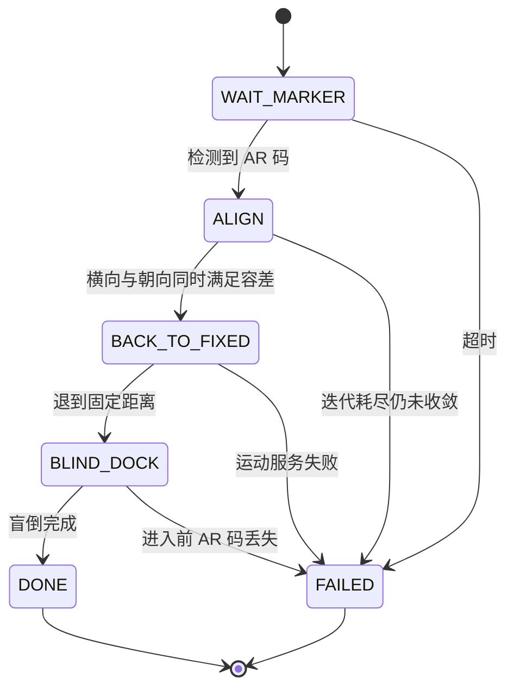

# bobac3_auto_charge

基于 AR 码视觉引导的服务机器人自主回充节点（ROS / C++）。

机器人用后置底部相机识别充电桩上的 AR 码，解算出相对充电桩的位姿偏差，
通过三阶段状态机自主完成对准与对接，全过程不需要人工干预。

## 状态机



三个阶段各自解决一个问题：

| 阶段 | 目标 | 依赖 |
|---|---|---|
| ALIGN | 把横向偏差和朝向偏差同时压进容差 | 视觉闭环 |
| BACK_TO_FIXED | 退到与充电桩的固定距离，让剩余位移变成定值 | 视觉闭环 |
| BLIND_DOCK | 走完最后一段定长位移，上桩 | 开环 |

拆成三段的原因：AR 码装位低，近距离会脱出相机视野，最后一段天然无法闭环。
把「无法闭环的那一段」压缩成一个已知的固定值，是这套方案的核心取舍。

## 硬件与依赖

- 机器人：Bobac3（ROS 移动机器人平台，后置底部 USB 相机）
- ROS：Kinetic / Melodic（catkin）
- 依赖包：
  - `roscpp`
  - `ar_track_alvar_msgs`（AR 码识别结果）
  - `relative_move`（相对运动服务 `SetRelativeMove`）

运行前需启动：`bobac3_base_node`、`relative_move_node`、`ar_track_alvar`、`usb_cam`。

## 目录结构

```
bobac3_auto_charge/
├── CMakeLists.txt
├── package.xml
├── README.md
├── config/
│   └── charge_params.yaml      # 全部阈值，现场调试改这里
├── launch/
│   └── auto_charge.launch      # 启动节点并加载参数
└── src/
    └── auto_charge_node.cpp    # 三阶段状态机与视觉引导逻辑
```

## 编译与运行

```bash
# 放入工作空间
cp -r bobac3_auto_charge ~/catkin_ws/src/
cd ~/catkin_ws
catkin_make
source devel/setup.bash

roslaunch bobac3_auto_charge auto_charge.launch
```

上电前把充电桩靠墙固定，手动将机器人后置相机对准 AR 码、距离约 50cm，拔出急停。

## 参数

全部阈值在 `config/charge_params.yaml` 中，改完重新 `roslaunch` 即可生效，不需要重新编译。

| 参数 | 默认值 | 说明 |
|---|---|---|
| `x_tolerance` | 0.03 m | 横向偏差容差 |
| `yaw_tolerance` | 0.05 rad | 朝向偏差容差（约 2.9°） |
| `max_align_iter` | 8 | 对准最大迭代次数 |
| `stall_threshold` | 0.05 | 归一化残差改善低于该值视为停滞，连续两轮停滞即中止 |
| `fixed_distance` | 0.20 m | 对准后退到的固定点距离 |
| `docking_distance` | 0.35 m | 盲倒对接距离 |
| `step_size` | 0.05 m | 前后位移分段步长 |
| `step_delay` | 0.30 s | 每步之间延时 |
| `settle_time` | 0.30 s | 动作后等待位姿稳定 |
| `samples_per_measure` | 5 | 每次决策前采样帧数（取均值） |
| `marker_timeout` | 3.0 s | 等待 AR 码超时 |
| `marker_stale_sec` | 0.5 s | 数据超过该时长视为失效 |
| `service_retry` | 2 | 运动服务失败重试次数 |

## 设计取舍

**1. 前后位移必须分段（`step_size = 5cm`）**

AR 码装位低，机器人与充电桩距离一近，AR 码就超出相机视野。一次走完会让最后一段变成盲走，
而这段恰恰是最需要精度的部分。改成分段后，每走一步都留出重新检测位姿的机会，
位姿全程可控。代价是多了些停顿，在这里用时间换可靠性是划算的。

**2. 一次只修正一个自由度**

横向偏差和朝向偏差在相机坐标系下是**耦合**的：机器人转动会同时改变 AR 码的横向读数。
如果一轮里把两个量一起修正，会出现在目标附近来回震荡、迟迟不收敛的现象。
所以每轮只修一个自由度，修完立即重新测量。优先修朝向——朝向没收敛时，横向读数本身不可信。

**3. 用多帧均值而不是单帧值做决策**

单帧 AR 码位姿抖动在 1cm 量级，和 3cm 的容差是同一数量级，直接拿单帧决策会让状态机误判收敛。
每次决策前清空历史样本、重新采集 N 帧取均值，保证决策用的是动作之后的新数据。

**4. 盲倒前最后确认一次目标可见**

进入开环阶段前，如果 AR 码已经丢失，说明位姿估计不可信。此时宁可中止并返回失败，
也不要盲走 —— 撞上充电桩的代价远高于一次对接失败。

**5. 对准不收敛时中止，而不是继续**

带着未收敛的残余偏差进入盲倒，会让误差被固定位移放大。这里选择直接失败退出，
把控制权交回人工。

**6. 全参数 ROS 参数化**

所有阈值从硬编码改为 ROS 参数，现场调试不需要重新编译。

## 已知限制

- 对准阶段对偏航角取多帧算术平均，这在偏航角接近 0 时成立；若初始朝向偏差过大导致
  角度跨越 ±π，均值会失真。当前使用场景由人工摆放保证初始偏差较小。
- 盲倒段位移为标定值，充电桩位置变动后需要重新标定 `docking_distance`。
- 未做多 AR 码区分，只取检测结果中的第一个 marker。

## 实测

实测方法：机器人从标称起点出发连续跑 20 次，从节点日志统计三个指标。

```bash
# 单次运行
roslaunch bobac3_auto_charge auto_charge.launch

# 连续跑 20 次并落盘日志（每轮之间需人工把机器人摆回起点）
mkdir -p ~/charge_test
for i in $(seq 1 20); do
  roslaunch bobac3_auto_charge auto_charge.launch 2>&1 | tee ~/charge_test/run_$i.log
  sleep 5
done

# 统计成功次数
grep -l "Auto Charge \[SUCCESS\]" ~/charge_test/run_*.log | wc -l

# 逐轮看对准迭代次数与耗时
grep -hE "Auto Charge \[|converged in" ~/charge_test/run_*.log
```

| 指标 | 结果 |
|---|---|
| 连续 20 次对接成功 | 待实测回填 |
| 平均对准迭代次数 | 待实测回填 |
| 平均单次耗时 | 待实测回填 |
| 主要失败原因 | 待实测回填 |

> 以上数据需实机跑完后回填，当前未标注数值。


## 许可

课程实训项目，仅用于学习与交流。

## 说明

课程实训项目。基线实现来自实训指导书，本仓库为个人重构版本，
补充了参数化配置、多帧测量、数据时效校验、服务重试、开环前安全检查，
并把过程日志改为可统计的形式，便于评估成功率。